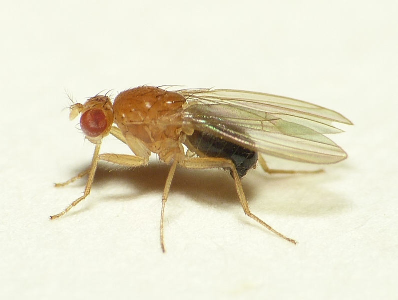
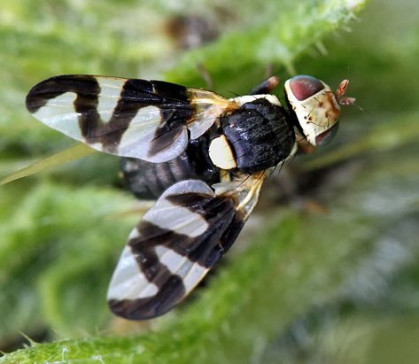

**Question 1: What is the more common family of fruit flies to the public?**
```{r, out.width="30%", fig.align="left", echo=FALSE}

```

```{r, out.width="30%", fig.align="left"  , echo=FALSE}

```


::: {=html}
<form id="q1">
  <input type="radio" name="q1" value="a"> A. Tephritidae <br>
  <input type="radio" name="q1" value="b"> B. Drosophilidiae <br>
  <input type="radio" name="q1" value="c"> C. Drosophilidae <br>
  <input type="radio" name="q1" value="d"> D. Tephritidiae <br><br>
  <button type="button" onclick="checkAnswer('q1','a')">Submit</button>
</form>
<div id="result-q1" style="margin-top:1em;font-weight:bold;"></div>


:::


**Question 2: What commonly makes Tephritids "bad"?**

::: {=html}
<form id="q2">
  <input type="radio" name="q2" value="a"> A. They have the highest fitness <br>
  <input type="radio" name="q2" value="b"> B. Being colourful means they are better at being sneaky <br>
  <input type="radio" name="q2" value="c"> C. The females use their ovipositor to lay their eggs in the fruit, where larvae develop <br>
  <input type="radio" name="q2" value="d"> D. They're bigger than Drosophila, so they can do more <br><br>
  <button type="button" onclick="checkAnswer('q2','c')">Submit</button>
</form>
<div id="result-q2" style="margin-top:1em;font-weight:bold;"></div>
:::


**Question 3: What's the other name for Tephritid flies?**

::: {=html}
<form id="q3">
  <input type="radio" name="q3" value="a"> A. Peacock flies <br>
  <input type="radio" name="q3" value="b"> B. Parrot flies <br>
  <input type="radio" name="q3" value="c"> C. Rainbow flies <br>
  <input type="radio" name="q3" value="d"> D. Robin flies <br><br>
  <button type="button" onclick="checkAnswer('q3','a')">Submit</button>
</form>
<div id="result-q3" style="margin-top:1em;font-weight:bold;"></div>
:::


**Question 4: Why are Medflies the more harsh Tephritids?**

::: {=html}
<form id="q4">
  <input type="radio" name="q4" value="a"> A. They can survive in cooler temperatures compared to other Tephritids .<br>
  <input type="radio" name="q4" value="b"> B. Despite using long reads, the taxonomic classifiers couldn’t resolve taxa beyond the genus level.<br>
  <input type="radio" name="q4" value="c"> C. Long reads introduced large sequencing errors that prevented assembly.<br>
  <input type="radio" name="q4" value="d"> D. They can survive in cooler temperatures compared to other Tephritids.<br><br>
  <button type="button" onclick="checkAnswer('q4','d')">Submit</button>
</form>
<div id="result-q4" style="margin-top:1em;font-weight:bold;"></div>
:::


<div id="score" style="margin-top:2em; font-weight:bold; font-size:1.2em;"></div>

```{=html}
<script>
let score = 0;
let total = 4; // total number of questions
let answered = {}; // track which questions have been answered to avoid double scoring

function checkAnswer(id, correct) {
  const answer = document.querySelector(`#${id} input[type='radio']:checked`);
  const result = document.getElementById(`result-${id}`);

  if (!answer) {
    result.textContent = "⚠️ Please select an answer.";
    result.style.color = "orange";
    return;
  }

  if (answered[id]) {
    result.textContent = "ℹ️ You’ve already answered this question.";
    result.style.color = "gray";
    return;
  }

  if (answer.value === correct) {
    result.textContent = "Correct!";
    result.style.color = "green";
    score++;
  } else {
    result.textContent = "Incorrect.";
    result.style.color = "red";
  }

  answered[id] = true;
  document.getElementById("score").textContent = `Current Score: ${score}/${total}`;
}
</script>
