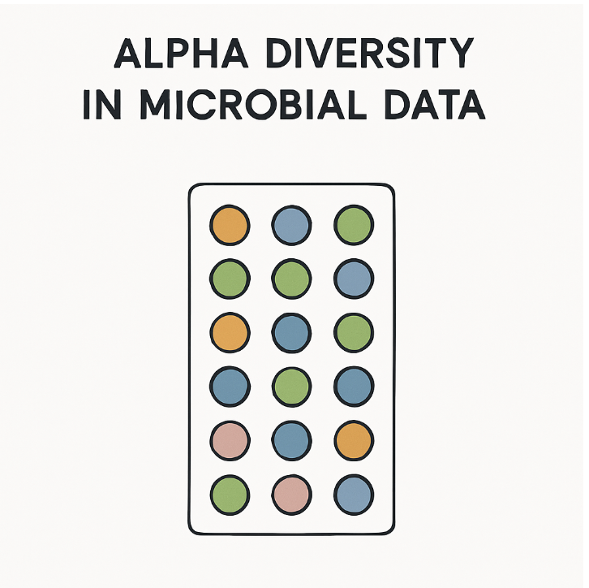
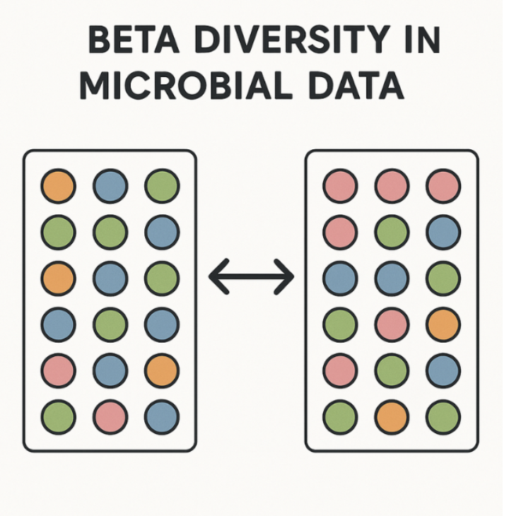
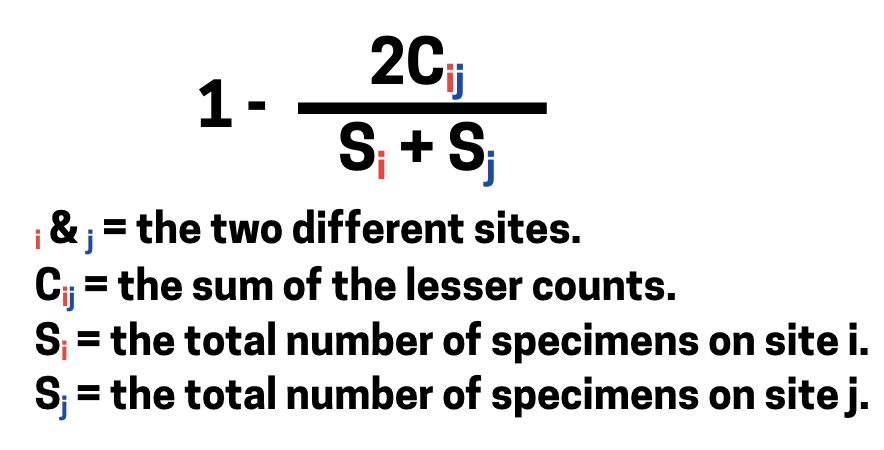
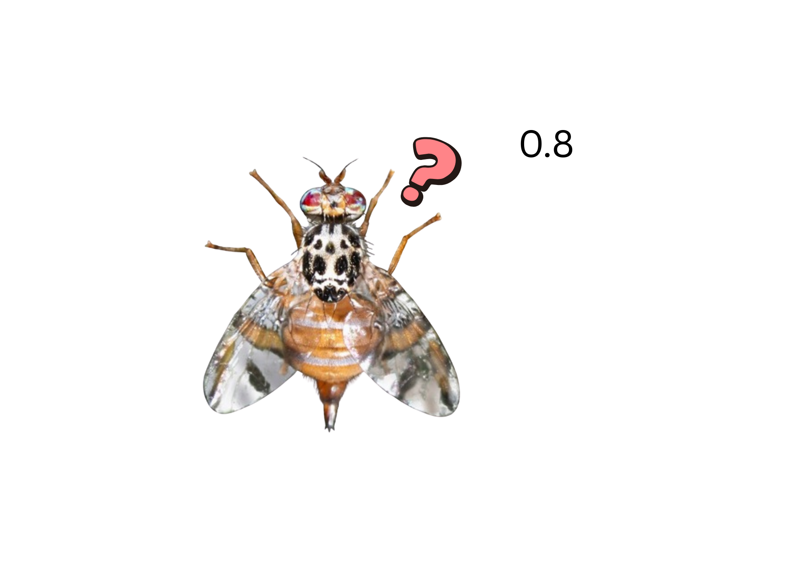
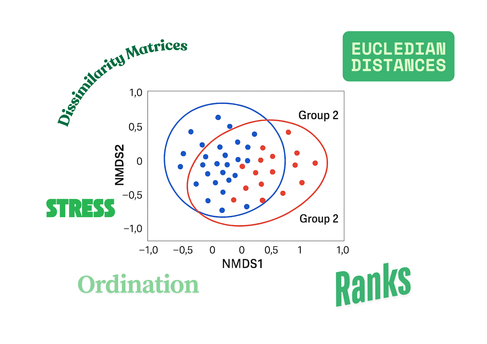

**Question 1: What are the differences between alpha and beta diversity?**

```{r, echo=FALSE}

```
```{r, echo=FALSE}

```


::: {=html}
<form id="q1">
  <input type="radio" name="q1" value="a">
  A. Alpha diversity measures species richness across multiple ecosystems, while beta diversity measures genetic variation within a single species. <br>
  <input type="radio" name="q1" value="b">
  B. Alpha diversity measures total global biodiversity, while beta diversity measures local abundance. <br>
  <input type="radio" name="q1" value="c">
  C. Alpha diversity measures diversity within a single community, while beta diversity compares diversity between different communities. <br>
  <input type="radio" name="q1" value="d">
  D. Alpha diversity refers to microbial abundance, while beta diversity refers to microbial function. <br><br>

  <button type="button" onclick="checkAnswer('q1','c')">Submit</button>
</form>
<div id="result-q1" style="margin-top:1em;font-weight:bold;"></div>
:::

**Question 2: What does Bray Curtis Disimilarity do?**

```{r, echo=FALSE}

```


::: {=html}
<form id="q2">
  <input type="radio" name="q2" value="a">
  A. The phylogenetic distance between microbial species based on evolutionary history. <br>
  <input type="radio" name="q2" value="b">
  B. The richness of species within a single microbial community. <br>
  <input type="radio" name="q2" value="c">
  C. The compositional dissimilarity between two samples based on species abundance data. <br>
  <input type="radio" name="q2" value="d">
  D. The probability that two randomly selected individuals belong to the same species. <br><br>
  <button type="button" onclick="checkAnswer('q2','c')">Submit</button>
</form>
<div id="result-q2" style="margin-top:1em;font-weight:bold;"></div>
:::

**Question 3: I do some Bray Curtis disimilarity analysis based on fly lines from two different substrate samples in the lab, I get a value of 0.8, what does this mean?**

```{r, echo=FALSE}

```


::: {=html}
<form id="q3">
  <input type="radio" name="q3" value="a">
  A. The two fly lines microbiotas are nearly identical in composition. <br>
  <input type="radio" name="q3" value="b">
  B. The two samples share exactly 80% of their microbial species. <br>
  <input type="radio" name="q3" value="c">
  C. The two samples are highly dissimilar in microbial community composition. <br>


  <button type="button" onclick="checkAnswer('q3','c')">Submit</button>
</form>
<div id="result-q3" style="margin-top:1em;font-weight:bold;"></div>
:::


**Question 4: NMDS is an ordination technique, which is used to visualise similarities or dissimilarities in data. How does it do this?**

```{r, echo=FALSE}

```

::: {=html}
<form id="q4">
  <input type="radio" name="q4" value="a">
  A. It does not preserve actual distances between samples, but instead maintains the rank order of those distances. <br>
  <input type="radio" name="q4" value="b">
  B. It projects samples onto axes that maximise total variance using eigenvectors from a covariance matrix. <br>
  <input type="radio" name="q4" value="c">
  C. It preserves exact pairwise distances by decomposing a distance matrix into principal coordinate axes. <br>
  <input type="radio" name="q4" value="d">
  D. It transforms abundance data into relative percentages and clusters samples based on shared taxa only. <br><br>
  <button type="button" onclick="checkAnswer('q4','a')">Submit</button>
</form>
<div id="result-q4" style="margin-top:1em;font-weight:bold;"></div>
:::


**Question 5: We learnt a bit about Bray Curtis dissimiliarity, how does this relate to NMDS?**

```{r, echo=FALSE}

```


::: {=html}
<form id="q5">
  <input type="radio" name="q5" value="a">
  A. Bray–Curtis calculates phylogenetic relationships between microbes, which NMDS then uses to cluster samples. <br>
  <input type="radio" name="q5" value="b">
  B. NMDS requires Euclidean distances, so Bray–Curtis must first convert abundances into presence/absence. <br>
  <input type="radio" name="q5" value="c">
  C. Bray–Curtis measures compositional dissimilarity between samples, and NMDS uses these dissimilarities to visualise differences in low-dimensional space. <br>
  <input type="radio" name="q5" value="d">
  D. Bray–Curtis computes alpha diversity for each sample, which NMDS then projects onto axes to show individual sample diversity. <br><br>

  <button type="button" onclick="checkAnswer('q5','c')">Submit</button>
</form>
<div id="result-q5" style="margin-top:1em;font-weight:bold;"></div>
:::


**Question 6: If we want to run NMDS in R, we use `metaMDS()`. What are the main components?**

```{r, echo=FALSE}

```

::: {=html}
<form id="q6">
  <input type="radio" name="q6" value="a">
  A. `k` sets the number of random iterations, and `distance` chooses the method for standardizing alpha diversity. <br>
  <input type="radio" name="q6" value="b">
  B. `k` specifies the number of microbial taxa to include, and `distance` sets the physical distance between samples in the lab. <br>
  <input type="radio" name="q6" value="c">
  C. `k` sets the number of NMDS dimensions (axes), and `distance` specifies the dissimilarity metric used to calculate the distance matrix (e.g., `"bray"`). <br>
  <input type="radio" name="q6" value="d">
  D. `k` defines the number of principal components, and `distance` calculates Euclidean distance for alpha diversity. <br><br>
  <button type="button" onclick="checkAnswer('q6','c')">Submit</button>
</form>

<div id="result-q6" style="margin-top:1em;font-weight:bold;"></div>
:::


<div id="score" style="margin-top:2em; font-weight:bold; font-size:1.2em;"></div>

```{=html}
<script>
let score = 0;
let total = 6; // total number of questions
let answered = {}; // track which questions have been answered to avoid double scoring

function checkAnswer(id, correct) {
  const answer = document.querySelector(`#${id} input[type='radio']:checked`);
  const result = document.getElementById(`result-${id}`);

  if (!answer) {
    result.textContent = "Please select an answer.";
    result.style.color = "orange";
    return;
  }

  if (answered[id]) {
    result.textContent = "You’ve already answered this question.";
    result.style.color = "gray";
    return;
  }

  if (answer.value === correct) {
    result.textContent = "Correct!";
    result.style.color = "green";
    score++;
  } else {
    result.textContent = "Incorrect.";
    result.style.color = "red";
  }

  answered[id] = true;
  document.getElementById("score").textContent = `Current Score: ${score}/${total}`;
}
</script>
