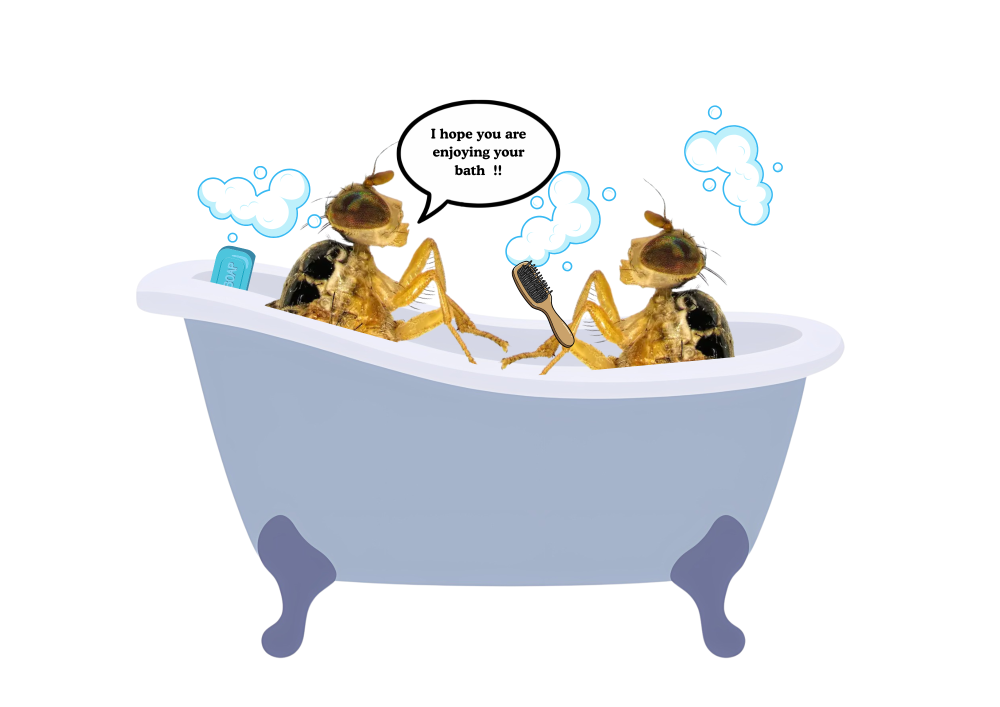
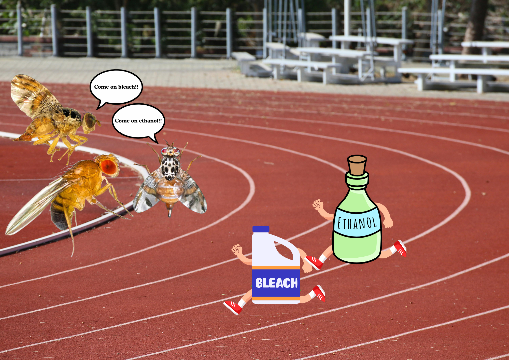
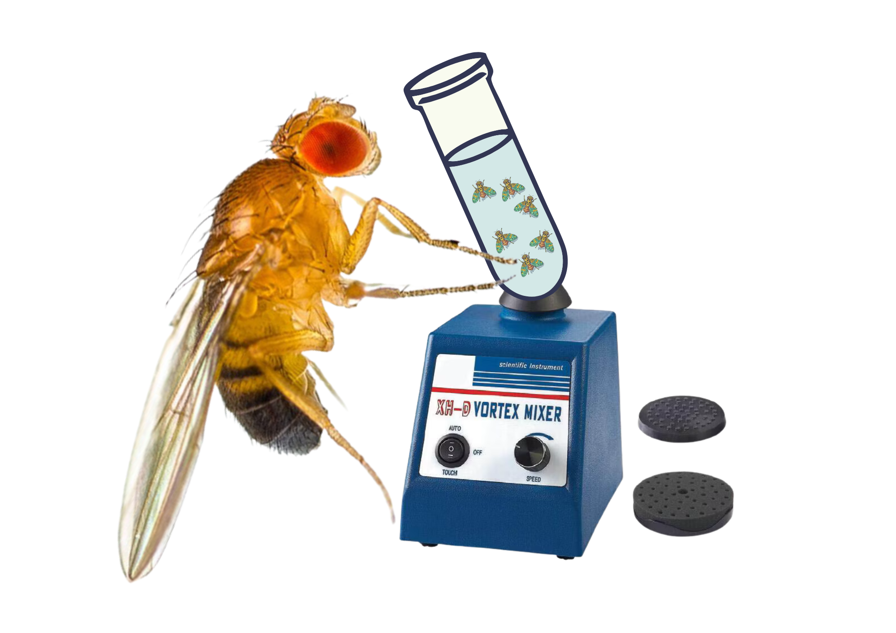
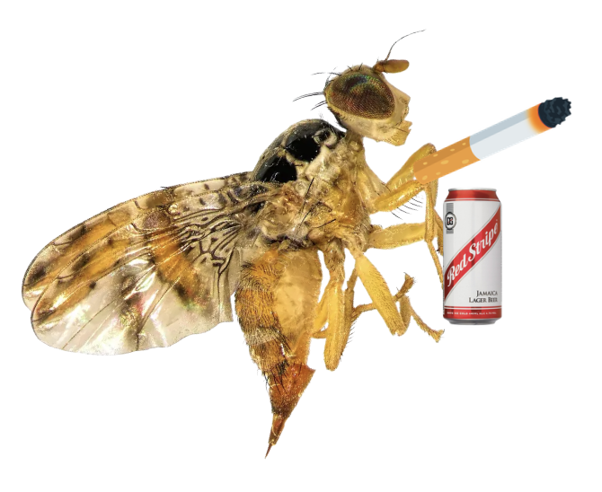
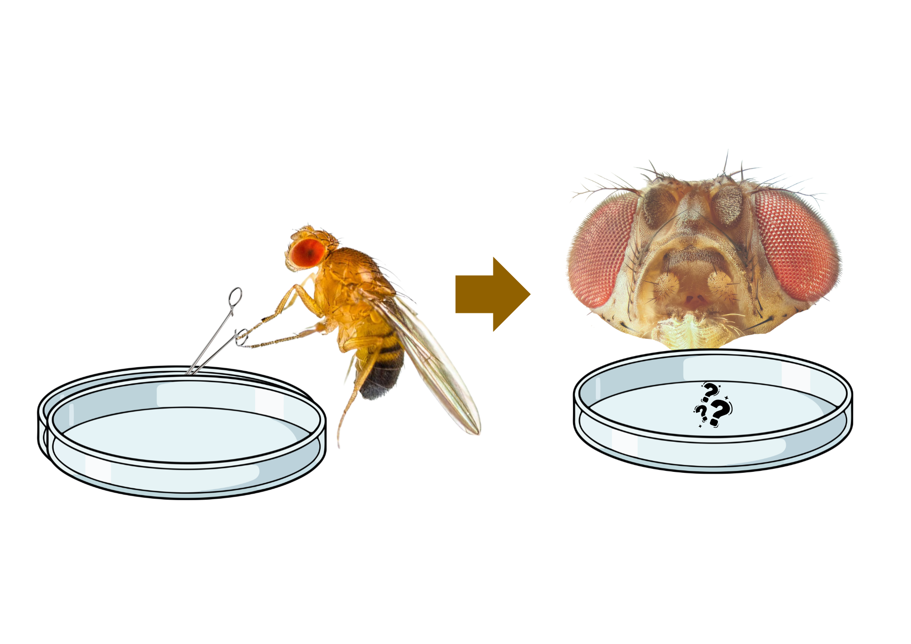

## Question 1: What is surface sterilisation in context I described?

```{r, echo=FALSE}

```


::: {=html}
<form id="q1">
  <input type="radio" name="q1" value="a"> A. Washing the bench surface in the lab so you don't contaminate the fly in microbiota experiments.  <br>
  <input type="radio" name="q1" value="b"> B. Washing the surface of the fly to remove external microbes <br>
  <input type="radio" name="q1" value="c"> C. Putting fly in bath  <br>
  <input type="radio" name="q1" value="d"> D. Washing the outside of the cage which you will collect flies on, to not infect its mcirobiota <br><br>
  <button type="button" onclick="checkAnswer('q1','b')">Submit</button>
</form>
<div id="result-q1" style="margin-top:1em;font-weight:bold;"></div>
:::

---

## Question 2: What is a difference between bleach and ethanol for surface sterilisation?

```{r, echo=FALSE}

```


::: {=html}
<form id="q2">
  <input type="radio" name="q2" value="a"> A.Ethanol destroys DNA, while bleach leaves DNA intact. <br>
  <input type="radio" name="q2" value="b"> B. Bleach destroys DNA, while ethanol does not destroy DNA.<br>
  <input type="radio" name="q2" value="c"> C.Both bleach and ethanol preserve DNA while killing microbes. <br>
  <input type="radio" name="q2" value="d"> D. Bleach works only on bacteria, ethanol works only on viruses<br><br>
  <button type="button" onclick="checkAnswer('q2','b')">Submit</button>
</form>
<div id="result-q2" style="margin-top:1em;font-weight:bold;"></div>
:::

---

---

**Question 3: How do we (in the Chapman group) give the Medfly a wash?**


```{r, echo=FALSE}

```

::: {=html}
<form id="q3">
  <input type="radio" name="q3" value="a"> A. Dunk it in ethanol for 1 minute, followed by 3x 30 seconds PBS washes. <br>
  <input type="radio" name="q3" value="b"> B. Dunk it in ethanol for 30 seconds, followed by 3x 30 seconds PBS washes.<br>
  <input type="radio" name="q3" value="c"> C. Dunk it in bleach for 1 minute, followed by 3x 30 seconds PBS washes <br>
  <input type="radio" name="q3" value="d"> D. Dunk it in bleach for 30 seconds, followed by 3x 30 seconds PBS washes.<br><br>
  <button type="button" onclick="checkAnswer('q3','c')">Submit</button>
</form>
<div id="result-q3" style="margin-top:1em;font-weight:bold;"></div>
:::

---

---

**Question 4: What might happen if we left the fly in the "sterilising" solution for too long?**

```{r, echo=FALSE}

```

::: {=html}
<form id="q4">
  <input type="radio" name="q4" value="a"> A. The fly might wake up and fly away.<br>
  <input type="radio" name="q4" value="b"> B. The fly could become larger and easier to see.<br>
  <input type="radio" name="q4" value="c"> C. The wings might change colour permanently.<br>
  <input type="radio" name="q4" value="d"> D. The fly’s body could become damaged or too fragile to dissect properly.<br><br>
  <button type="button" onclick="checkAnswer('q4','d')">Submit</button>
</form>
<div id="result-q4" style="margin-top:1em;font-weight:bold;"></div>
:::

---

---

**Question 5: Scenario: A Medfly has been taken straight from its cage, is then anesthesised and put in liquid nitrogen, and then the -80C. We take this fly from the -80m allow it to thaw, then put it in  sterile PBS for 30 seconds, and repeat this 3x with 3 different sterile PBS washes. We then pick up the fly with sterile forceps and spread it on a sterile LB plate, we leave this plate to incubate. What is likely to grow?**

```{r, echo=FALSE}

```

::: {=html}
<form id="q5">
  <input type="radio" name="q5" value="a"> A. The plate is likely to grow bacteria but only because there's bits of fly on it. <br>
  <input type="radio" name="q5" value="b"> B. If the experiment works, then nothing as the fly has been washed. <br>
  <input type="radio" name="q5" value="c"> C. The plate is likely to grow bacteria because the fly has not been washed.  <br>
  <button type="button" onclick="checkAnswer('q5','c')">Submit</button>
</form>
<div id="result-q5" style="margin-top:1em;font-weight:bold;"></div>
:::

---


<div id="score" style="margin-top:2em; font-weight:bold; font-size:1.2em;"></div>

```{=html}
<script>
let score = 0;
let total = 5; // total number of questions
let answered = {};

function checkAnswer(id, correct) {
  const answer = document.querySelector(`#${id} input[type='radio']:checked`);
  const result = document.getElementById(`result-${id}`);

  if (!answer) {
    result.textContent = " Please select an answer.";
    result.style.color = "orange";
    return;
  }

  if (answered[id]) {
    result.textContent = "You’ve already answered this question.";
    result.style.color = "gray";
    return;
  }

  if (answer.value === correct) {
    result.textContent = "Correct!";
    result.style.color = "green";
    score++;
  } else {
    result.textContent = "Incorrect.";
    result.style.color = "red";
  }

  answered[id] = true;
  document.getElementById("score").textContent = `Current Score: ${score}/${total}`;
}
</script>
